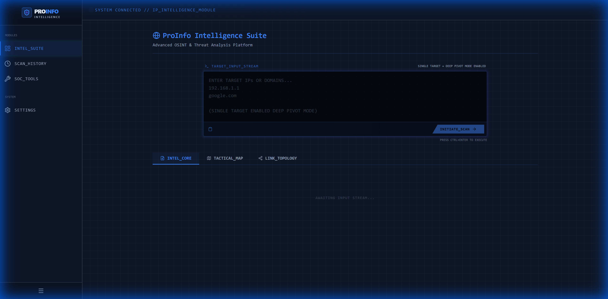
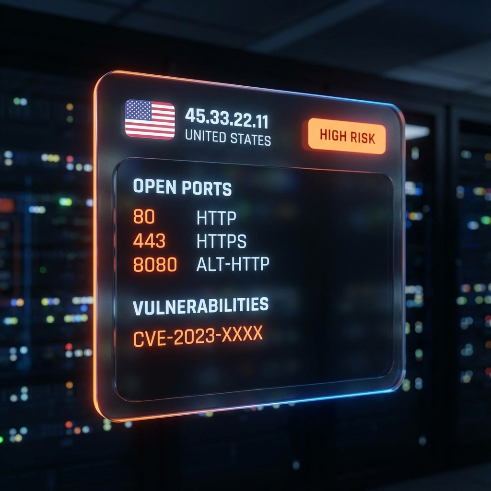
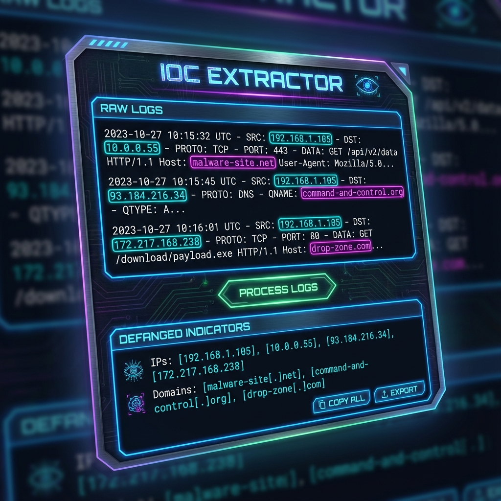

# ProInfo Intelligence Suite 🛡️

<div align="center">


<br/>

**The Professional-Grade Recursive OSINT & Threat Analysis Platform**
<br/>
*Transforming static data into actionable intelligence graphs.*

<br/>



[Report Bug](https://github.com/yourusername/proinfo-suite/issues) · [Request Feature](https://github.com/yourusername/proinfo-suite/issues)

</div>

---

## ⚡ Overview

**ProInfo** is not just another IP lookup tool. It is a **tactical intelligence dashboard** designed for SOC analysts, Threat Hunters, and Red Teamers. By combining multiple intelligence streams (WHOIS, DNS, GeoIP, Shodan, AbuseIPDB) into a single, cohesive interface, ProInfo allows you to **pivot recursively** through infrastructure, uncovering hidden connections that simple CLI tools miss.

### 🌟 Why ProInfo?
- **Recursive by Design**: Don't just stop at an IP. Pivot to domains, then back to IPs, building a full map of the adversary's infrastructure.
- **Privacy-Centric**: Zero backend tracking. Your investigation data lives in your browser's memory and local storage.
- **Visual First**: High-fidelity heatmaps and topology graphs make complex data instantly understandable.

---

## 🚀 Capabilities & Visuals

### 1. 🧠 INTEL_CORE Dashboard
The command center for your investigation. Merges Identity, Infrastructure, and Attack Surface data into high-contrast cards.

| Feature | Description |
| :--- | :--- |
| **Identity** | Precision Geolocation, ASN Owner, and ISP data. |
| **Trust** | Integrated **AbuseIPDB** confidence scores (0-100%) to instantly spot malicious actors. |
| **Surface** | Full port scans and CVE vulnerability mapping powered by **Shodan InternetDB**. |


*(Concept Visualization)*

### 2. 🕸️ Recursive Pivot Engine (New)
The heart of ProInfo. Recursively traverse the internet's graph structure.

> **Scenario**: You start with `malicious-site.com`. ProInfo resolves it to `1.2.3.4`. You pivot on the IP and find it hosts 5 other domains. You pivot on those domains and find a hidden backend server `admin.corp-internal.net`.

- **Hierarchical View**: Results are indented with connectors (`↳`) to show the chain of custody.
- **Infinite Depth**: Keep expanding as long as you find connections.
- **Multi-Vector**: Pivot from IP -> Domain and Domain -> IP seamlessly.


*Visualizing the Recursive Pivot Logic: The diagram above demonstrates the vertical hierarchical flow. Starting from a root domain, the system resolves its IP, which then reveals a PTR record, creating a clear, indented lineage of your investigation.*

### 3. 🗺️ Tactical Heatmap
Visualize the physical distribution of your targets across the globe.
- **"Cyber-Radiation" Style**: Red glowing zones indicate high-threat density or critical assets.
- **Interactive**: Click any node to jump to its intel card.


*(Concept Visualization)*

### 4. 🛠️ SOC Power Tools
Dedicated utilities for the daily grind of a security analyst.
- **IOC Extractor**: Paste a messy email header or log file. ProInfo extracts IPs, Domains, and Hashes, and "defangs" them (e.g., `example[.]com`) for safe reporting.


*(Concept Visualization)*

---

## 📚 Use Cases

### 🔵 Blue Team / SOC
*   **Incident Response**: Quickly triage an alert. Is this IP known bad? (AbuseIPDB check). What else is hosted there? (Reverse DNS).
*   **Phishing Analysis**: Take a URL from a suspicious email, extract the domain, resolve the hosting IP, and see if it's a known bulletproof host.

### 🔴 Red Team / Pentest
*   **Reconnaissance**: Map out an organization's external attack surface.
*   **Asset Discovery**: Use recursive pivoting to find "forgotten" subdomains or dev servers hosted on the same infrastructure.

---

## ⚡ Getting Started

### Prerequisites
- Node.js 18+
- npm or pnpm

### Installation

1.  **Clone the Repository**
    ```bash
    git clone https://github.com/yourusername/proinfo-suite.git
    cd proinfo-suite
    ```

2.  **Install Dependencies**
    ```bash
    npm install
    ```

3.  **Configure API Keys (Optional but Recommended)**
    Create a `.env.local` file to bypass rate limits:
    ```ini
    VITE_IPWHOIS_API_KEY=your_key_here
    VITE_ABUSEIPDB_API_KEY=your_key_here
    ```

4.  **Launch**
    ```bash
    npm run dev
    ```

---

## 🔮 Roadmap: The Next Level

We are actively building the future of OSINT.

- [ ] **Phase 2: Cognitive Intelligence (AI)**
    - Integration with local LLMs (Ollama) to "summarize" threat reports.
    - Anomaly detection in large datasets.
- [ ] **Phase 3: Active Monitoring**
    - WebSocket alerts for real-time infrastructure changes.
- [ ] **Phase 4: Dark Web Sensors**
    - Integration with Onion/Tor search indices.

---

## 🛠️ Technology Stack

| Component | Tech Choice | Reason |
| :--- | :--- | :--- |
| **Frontend** | React 18 + Vite | Blazing fast performance and HMR. |
| **Language** | TypeScript | Type safety for complex data structures. |
| **Styling** | TailwindCSS | Rapid, consistent, modern UI design. |
| **Animation** | Framer Motion | Smooth, professional transitions. |
| **Data** | LocalStorage | Zero-backend persistence for privacy. |

---

## 📄 License
Distributed under the MIT License. See `LICENSE` for more information.

<div align="center">
  <br/>
  <b>Built with ❤️ for the Infosec Community</b>
</div>

<!-- 
SEO Keywords:
OSINT Dashboard, Open Source Intelligence Tool, Recursive IP Scanner, Threat Analysis Platform, SOC Dashboard, 
Threat Hunting Tool, Passive DNS Lookup, Shodan Integration, AbuseIPDB Visualizer, React Intelligence Application, 
Cybersecurity Pivot Tool, Investigation Graph, Infrastructure Mapping, Red Team Reconnaissance, Blue Team Triage.
-->
